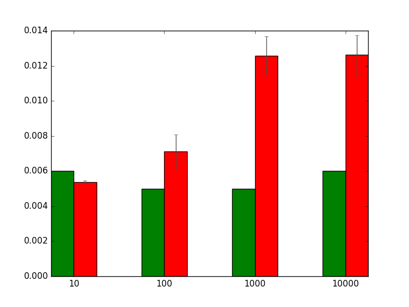
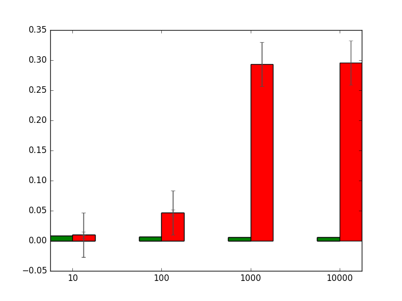
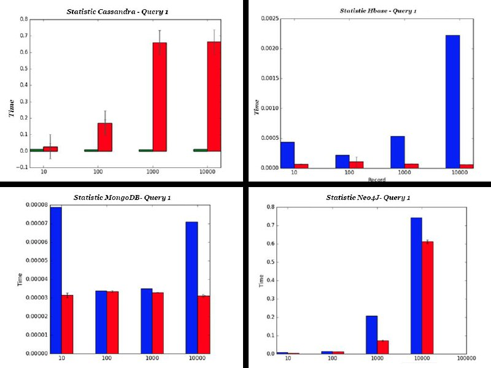
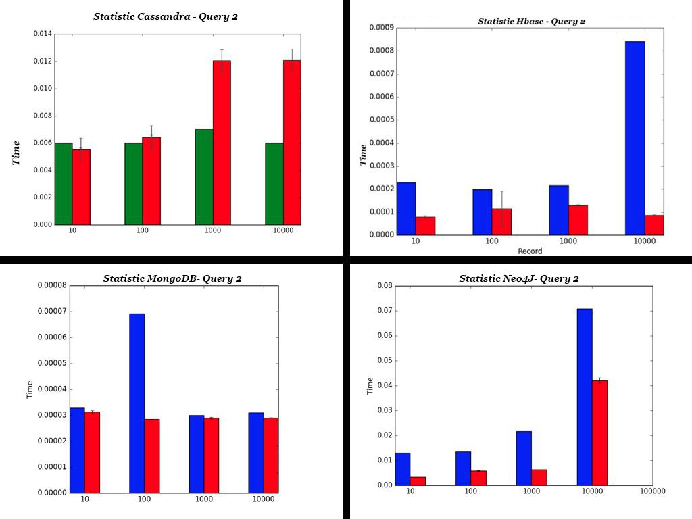
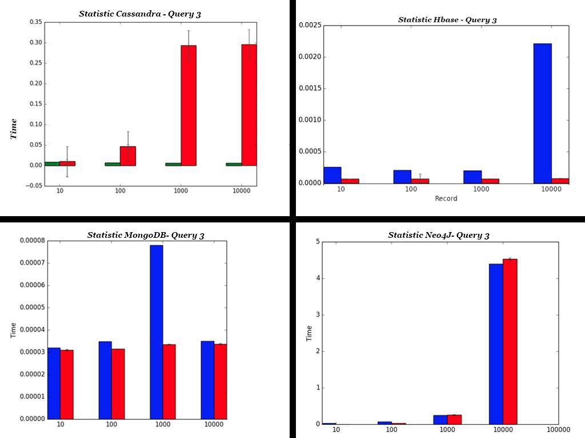

\title{\textsc{Realizzazione database di un \\ Hospital Information System (HIS) basato su Cassandra }}
\author{\textbf{Salvatore Bertoncini, Nazzareno di Pietro} \\ \\
\textsc{Università degli Studi di Messina} \\ \\
Dipartimento di Scienze Matematiche e Informatiche, \\ Scienze Fisiche e Scienze della Terra}

\newpage

\maketitle

\newpage

\tableofcontents

\newpage

#Introduzione

## Richiesta
Si richiede la realizzazione di un applicativo che simuli il funzionamento e le prestazioni di un database NoSql su uno schema preesistente. Il DBMS richiesto è nella fattispecie Cassandra.
L'applicativo richiede di generare in modo casuale i dati che andranno in seguito a popolare il database iniziale da uno schema preesistente, con dataset di 10, 100, 1000, 10000 e 100000 elementi.
Si richiede di analizzare le differenze in termini di costi ed efficienza con altri gruppi che stanno effettuando lo stesso progetto su database di tipo NoSql differenti (MongoDB, HBase, Neo4j). Si richede infine di plottare i risultati ottenuti e di confrontarli.

#Strumenti utilizzati

##DBMS: *DataStax DevCenter*
Il DBMS adoperato è DataStax DevCenter, scaricabile all'indirizzo [https://academy.datastax.com/downloads](https://academy.datastax.com/downloads): il tool permette di eseguire codice *CQL* per **Apache Cassandra**.

## IDE: *JetBrain PyCharm*
L'applicazione è stata implementata utilizzando il linguaggio Python 2.7, con IDE PyCharm di JetBrain nella versione Community (per gli studenti è possibile ottenere la versione *Professional* del prodotto con licenza di un anno utilizzando la mail della propria università, ad esempio codicefiscale@studenti.unime.it) scaricabile all'indirizzo [https://www.jetbrains.com/pycharm/download/#section=windows](https://www.jetbrains.com/pycharm/download/#section=windows). Il linguaggio è stato scelto a discapito di altri linguaggi perché permette di interfacciarsi agilmente con i vari DBMS assegnati nei vari progetti, permettendo dunque un risparmio di tempo non indifferente. Al fine della realizzazione dell'applicazione, è fondamentale scaricare il driver *cassandra-cluster*, attraverso un wizard guidato dallo stesso IDE.

## Stesura relazione: *Pandoc*
Per la stesura della relazione è stato utilizzato Pandoc, un strumento che permette di scrivere documenti in linguaggio markup e che converte successivamente gli stessi in \LaTeX , PDF e qualsiasi altro formato desiderato. Vi è inoltre la possibilità di utilizzare direttive \LaTeX direttamente all'interno del documento stesso. Per poter utilizzare Pandoc è necessario installare \TeX (consigliabile MikTex).

#Progettazione
Il progetto è stato realizzato suddividendolo in tre parti fondamentali

##Connessione al DBMS
Per realizzare la connessione al DBMS è necessario dapprima installare, attraverso procedura guidata dall'IDE, il driver che consente di interfacciare il DBMS al nostro codice, e nella fattispecie il driver utilizzato risulta essere *cassandra-cluster* . Successivamente, bisognerà selezionare il keyspace bersaglio sul quale operare.

##Gestione Dataset in JSON
La gestione dei vari dataset in JSON è facilitata in Python grazie all'utilizzo della libreria **json**. In questo caso è stato previsto l'utilizzo di una funzione che consente di selezionare il dataset adatto in base all'esigenza e un'altra che consente il caricamento dell'intero dataset così da poter effettuare le operazioni necessarie per lo svolgimento del progetto.

##Funzioni da implementare nel Main
Il Main ha la necessità di avere una funzione che consente lo svuotamento del DataBase e una che invece deve prevedere il caricamento di tutti i dati necessari nel DataBase, in base al Dataset selezionato. Infine, bisogna prevedere una funzione che tiene conto dei tempi di esecuzione di ciascuna query (che ricordiamo deve essere eseguita almeno 30 volte) per ogni Dataset.

#Implementazione

##Connessione al DBMS

Facendo riferimento a quanto scritto nel precedente capitolo, bisogna importare nell'IDE il driver *cassandra-cluster*. Fatto questo, bisogna dapprima importare *cassandra.cluster*, e successivamente è possibile accedere al proprio keyspace andando a specificarlo attraverso il seguente codice:

~~~python

from cassandra.cluster import Cluster

cluster = Cluster()
session = cluster.connect('db2_project')
~~~

Per facilitare e velocizzare le operazioni di querying, è stato implementato il seguente codice:

~~~python

def update(query):
    session.execute(query)

def query(query):
    return session.execute(query)
~~~

Infine, sono state stabilite le seguenti funzioni che restituiscono il risultato della query indicata:

~~~python

def query1():
    risultato = query("select * from patient;")
    return risultato

def query2():
    risultato = query("SELECT * FROM patient WHERE name = 'KRVYRSKX7' allow filtering;")
    return risultato

def query3():
    x = []
    risultato = query("select * from patient where " \
        "lwalk_training_duration < 2400 allow filtering;")
    for a in risultato:
        if (a[11] != None):
            if ((a[13] != 0.80) and (len(a[11]) > 4)):
                x.append(a)
    return risultato
~~~

##Gestione del Dataset in JSON

I vari Dataset sono stati pensati in JSON, col seguente schema d'esempio:

~~~json
[
    {
        "name": "string",
        "id": "autoinc",
        "width": "float",
        "height": "float",
        "l_shank": "float",
        "l_thigh": "float",
        "lokomat_shank": "float",
        "lokomat_thigh": "float",
        "lokomat_recorded": "timestamp",
        "version": "string",
        "legtype": "string",
        "lwalk_training_duration": "timestamp",
        "lwalk_distance": "float",
        "step_datas":
        [
            [0.0, 0.0, 0.0, 0.0, 0.0, 
            0.0, 0.0, 0.0, 0.0, 0.0, 
            0.0, 0.0, 0.0, 0.0, 0.0,
            0.0, 0.0, 0.0, 0.0, 0.0, 
            0.0, 0.0, 0.0, 0.0, 0.0, 
            0.0, 0.0, 0.0, 0.0, 0.0, 
            0.0, 0.0],
            [0.0, 0.0, 0.0, 0.0, 0.0, 
            0.0, 0.0, 0.0, 0.0, 0.0, 
            0.0, 0.0, 0.0, 0.0, 0.0,
            0.0, 0.0, 0.0, 0.0, 0.0, 
            0.0, 0.0, 0.0, 0.0, 0.0, 
            0.0, 0.0, 0.0, 0.0, 0.0, 
            0.0, 0.0],
            [0.0, 0.0, 0.0, 0.0, 0.0, 
            0.0, 0.0, 0.0, 0.0, 0.0, 
            0.0, 0.0, 0.0, 0.0, 0.0,
            0.0, 0.0, 0.0, 0.0, 0.0, 
            0.0, 0.0, 0.0, 0.0, 0.0, 
            0.0, 0.0, 0.0, 0.0, 0.0, 
            0.0, 0.0]
        ]
    }
]
~~~

In Python, la gestione dei Dataset avviene grazie alla libreria *json*, che bisogna importare. Successivamente, in base al Dataset che bisogna caricare, grazie alle funzioni open('json_name.json') e json.load(json) gestiamo il caricamento dei Dataset JSON, come si evince dal seguente codice:

~~~python

import json

def settaData(scelta):
    if(scelta == 0):
        with open('ds10.json') as data:
            record = json.load(data)
    elif (scelta == 1):
        with open('ds100.json') as data:
            record = json.load(data)
    elif (scelta == 2):
        with open('ds1000.json') as data:
            record = json.load(data)
    elif (scelta == 3):
        with open('ds10000.json') as data:
            record = json.load(data)
    elif (scelta == 4):
        with open('ds100000.json') as data:
            record = json.load(data)
    return record

def getAllData(scelta):
    record = settaData(scelta)
    return record
~~~

##Implementazione Main

Nel nostro Main importiamo dapprima tutti i file e le librerie necessari, quali ad esempio i file Connection e getJson, e le librerie *datetime*, utile per gestire e quantificare il tempo di ciascuna query, e *matplotlib.pyplot*, la quale deve essere prima inclusa nell'IDE come fatto in precedenza con *cassandra-cluster*. 
La funzione eliminaTuttiDati() consente di *"inizializzare"* e azzerare il DataBase:

~~~python

import Connection
import getJson
import datetime
import matplotlib.pyplot as plt
import numpy
import math

def eliminaTuttiDati():
    tab = ["patient"]
    i = 0
    while (i < len(tab)):
        query = "truncate " + tab[i] + ";"
        Connection.update(query)
        i = i + 1
~~~

Per l'inserimento dei dati contenuti nel Dataset scelto all'interno del DataBase è stata creata la funzione inserisciAllData(scelta), dove appunto scelta indica quale Dataset caricare. Un fatto rilevante è il caricamento dei vari *step_datas*, che sono array di array, all'interno del DataBase: è stato necessario dapprima definire un nuovo tipo che abbiamo chiamato *lista*, e successivamente impostare *step_datas* come **list<lista>**.

~~~sql
CREATE TYPE lista
(
	step_value list<text>
);

...
step_datas list<lista>
...

~~~

Per la gestione di questo tipo di dato è stato necessario adoperare un ciclo for all'interno del quale comporre la stringa che verrà utilizzata come query, come si evince dal codice seguente.
NB: bisogna valutare, attraverso un *if*, se il dato all'interno dell'array è un tipo *float* o *None*.

~~~python
def inserisciAllData(scelta):
    people = getJson.getAllData(scelta)
    step = ''
    for x in people:
        step = ''
        query = "insert into patient (id, name, width, height, l_shank, l_thigh, " \
        	"lokomat_shank, lokomat_thigh, lokomat_recorded, version, legtype, " \
        	"lwalk_training_duration, lwalk_distance, step_datas) " \
            "values ("+ str(x['id'])+", '" + str(x['name']) + "', " + str(x['width']) \
            + ", "+ str(x['height']) +", "+ str(x['l_shank'])+", "+ str(x['l_thigh']) \
            + ", " + str(x['lokomat_shank'])+", "+ str(x['lokomat_thigh'])+", " \ 
            + str(x['lokomat_recorded'])+", '"+ str(x['version'])+"', '" \
            + str(x['legtype'])+"', "+ str(x['lwalk_training_duration']) \
            +", "+ str(x['lwalk_distance'])+", "
        step += "["
        for s in x['step_datas']:
            step += "{step_value: "
            step += "["
            for a in s:
                if (a == None):
                    step += "'None', "
                else:
                    step += "'"+str(a)+"', "
            step = step[:-2]
            step += "]}, "
        if(len(x['step_datas']) > 0):
            step = step[:-2]
        step += "]"
        query += step
        query += ");"

        Connection.update(query)
~~~

L'ultima funzione da creare è stata quella che, in base al Dataset selezionato, ha permesso la misurazione del tempo necessario per effettuare ogni query. Nello specifico, è stata isolata (e registrata) la misurazione della prima query, e successivamente è stata presa in considerazione la misurazione media delle altre 30 query. I risultati sono stati plottati grazie alla libreria *matplotlib.pyplot* (abbreviata per comodità nel codice con *plt*), attraverso la funzione *plot*, utilizzando le due label dell'asse *x* e *y*, e la funzione *savefig* che ha permesso la creazione dell'immagine con estensione **png**.

La seguente funzione è stata adoperata per la stampa dei risultati su grafico. I parametri che vengono passati sono le liste dei tempi della prima query eseguita e quella della media di tutti gli altri 30 tempi registrati. 

~~~python

def printMedia(all_first, all_media, scelta):
    all_mean = []
    all_stddev = []
    all_conf = []
    eConf = {'ecolor': '0.3'}

    # Media delle query
    for a in all_media:
        mean = numpy.mean(a)
        stddev = numpy.std(a)
        conf = 0.95 * (stddev / math.sqrt(len(a)))
        all_mean.append(mean)
        all_stddev.append(stddev)
        all_conf.append(conf)

        count = 0
        for firstTime in all_first:
            plt.bar(count, firstTime, width=0.5, color='g')
            count += 2

        count = 0
        for allTime in all_mean:
            print "stampo " +str(allTime)
            plt.bar(count + 0.5, allTime, width=0.5, yerr=conf, error_kw=eConf, color='r')
            count += 2

    plt.xticks([0.5, 2.5, 4.5, 6.5], ['10', '100', '1000', '10000'])
    plt.savefig('doc/query' + str(scelta+1) + '.png')
    plt.clf()

~~~

L'ultima funzione è la funzione che permette, in base alla query, di eliminare e caricare il Dataset adatto, ed eseguire 31 volte la query per ogni Dataset selezionato. 

~~~python

def iterazioneQuery():

    for i in range(0,2):
        if(i==0):

            tempi = []
            all_media = []
            all_first = []

            for a in range(0,4):
                print "situazione: query " + str(i+1) + " dataset " + str(a+1)
                #elimino dati su db e carico dataset
                eliminaTuttiDati()
                inserisciAllData(a)
                for _ in range(0, 31):
                    #eseguo la prima query sul dataset 30 volte
                    tPrima = datetime.datetime.now()
                    risultato = Connection.query1()
                    tTotale = datetime.datetime.now() - tPrima
                    tTotale = tTotale.total_seconds()
                    tempi.append(tTotale)
                # dentro first metto il tempo di esecuzione della prima query
                # dentro tempi i rimanenti 30 tempi calcolati
                first = tempi[0]
                tempi = tempi[1:]

                all_media.append(tempi)
                all_first.append(first)

            printMedia(all_first, all_media, i)

        elif(i==1):

            tempi = []
            all_media = []
            all_first = []

            for a in range(0, 4):
                print "situazione: query " + str(i + 1) + " dataset " + str(a + 1)
                # elimino dati su db e carico dataset
                eliminaTuttiDati()
                inserisciAllData(a)
                for _ in range(0, 31):
                    # eseguo la prima query sul dataset 30 volte
                    tPrima = datetime.datetime.now()
                    risultato = Connection.query2()
                    tTotale = datetime.datetime.now() - tPrima
                    tTotale = tTotale.total_seconds()
                    tempi.append(tTotale)
                # dentro first metto il tempo di esecuzione della prima query
                # dentro tempi i rimanenti 30 tempi calcolati
                first = tempi[0]
                tempi = tempi[1:]

                all_media.append(tempi)
                all_first.append(first)

            printMedia(all_first, all_media, i)

        elif(i==2):

            tempi = []
            all_media = []
            all_first = []

            for a in range(0, 4):
                print "situazione: query " + str(i + 1) + " dataset " + str(a + 1)
                # elimino dati su db e carico dataset
                eliminaTuttiDati()
                inserisciAllData(a)
                for _ in range(0, 31):
                    # eseguo la prima query sul dataset 30 volte
                    tPrima = datetime.datetime.now()
                    risultato = Connection.query3()
                    tTotale = datetime.datetime.now() - tPrima
                    tTotale = tTotale.total_seconds()
                    tempi.append(tTotale)
                # dentro first metto il tempo di esecuzione della prima query
                # dentro tempi i rimanenti 30 tempi calcolati
                first = tempi[0]
                tempi = tempi[1:]

                all_media.append(tempi)
                all_first.append(first)

            printMedia(all_first, all_media, i)

        i+=1

~~~

Infine il main vero e proprio, al cui interno c'è il seguente codice:

~~~python

plt.clf()
print("inizio processo")
iterazioneQuery()
print("processo terminato")

~~~

#Esperimenti

I grafici sono stati prodotti grazie alla libreria *matplotlib.pyplot*. Sono state invocate le funzioni *plt.bar()*, passando come argomenti i dati da plottare, *plt.xticks()*, passando come argomenti le etichette da stampare, *plt.savefig()*, indicando al suo interno come argomento il nome del file con estensione **.png**, e per concludere *plt.clf()* che aveva il compito di inizializzare il grafico. In ogni grafico, la barra verde rappresenta il tempo che ha impiegato la prima query per essere eseguita, la barra rossa invece indica la media delle 30 query eseguite successivamente. 

Come si evince dal grafico, le prestazioni medie di Cassandra per effettuare una query "banale" come un semplice "SELECT * FROM patient" aumentano esponenzialmente all'aumentare del numero dei dati contenuti nel DataBase, mentre la prima query sta relativamente poco per essere eseguita. Il tempo impiegato per l'esecuzione della query è di molto superiore rispetto le query successive.

Nel secondo grafico vediamo come la prima query risulta molto più vicina alla media delle altre 30 query, indipendentemente dal Dataset scelto. La crescita del tempo impiegato e quindi il ritardo nelle prestazioni risulta maggiormente evidente al crescere del numero dei dati contenuti nel Dataset. Il tempo impiegato è sensibilmente inferiore rispetto la prima query.

Nel terzo grafico vediamo come la prima query torni ad impiegare evidentemente meno tempo della media delle altre 30 query. Il tempo impiegato è comunque inferiore rispetto le query precedenti.

#Conclusioni

In conclusione possiamo affermare come, servendoci dei grafici per rafforzare la nostra tesi, nel nostro caso di utilizzo, che ricordiamo essere quello di un'applicazione che non utilizza Cluster bensì un solo elaboratore, la soluzione DBMS Cassandra appare sofferente rispetto **MongoDB**, che detiene le migliori performance, e **HBase**, mentre risulta di poco migliore rispetto *Neo4J*. La scelta di *Cassandra* non sembra dunque la più adatta per questo tipo di esigenza, nonostante online si possa reperire molta documentazione, operazione che rende agevole il *setting* dell'ambiente di testing. Di seguito le immagini dei confronti tra i vari DBMS *NoSql*.

